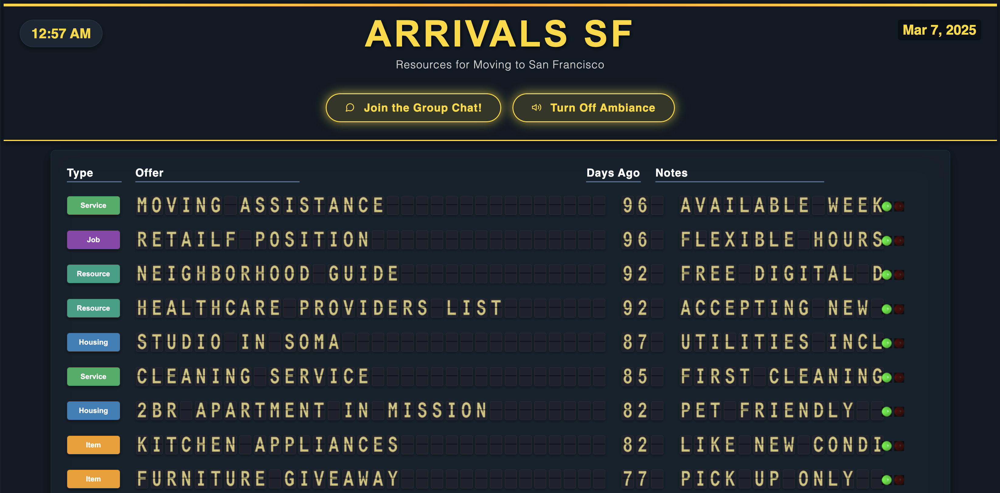

# San Francisco Moving Resources Split-Flap Display



A digital split-flap display board (Solari board) showing resources, services, and goods for people moving to San Francisco. This project creates a nostalgic, animated display reminiscent of classic train station arrival/departure boards, but repurposed to showcase moving assistance resources.

## 🌉 About The Project

This project adapts a subway split-flap display to show information about services and goods for people moving to San Francisco. It provides a visually engaging, animated board that displays categorized resources with their status.

### Features

- **Airport-Style "Arrivals SF" Header**: Large, prominent display reminiscent of airport arrival boards
- **Animated Split-Flap Display**: Authentic animation mimicking mechanical character flipping
- **Resource Categories**: Color-coded categories including Housing, Services, Items, Jobs, etc.
- **Status Indicators**: Visual indicators showing if resources are "Open" or require application
- **Community Chat Integration**: Button to join a Discord community for SF newcomers
- **Airport Ambiance Sound**: Authentic background audio to enhance the airport-like experience
- **Auto-Refresh**: Display automatically updates every 5 minutes
- **Easy Data Management**: Simple CSV format for adding/editing resources
- **Responsive Display**: Works in horizontal or vertical orientation

## 🚀 Getting Started

### Prerequisites

- [Node.js](https://nodejs.org/) (v10 or higher)
- [Python](https://www.python.org/) (v3.6 or higher)

### Installation

1. Clone the repository
   ```sh
   git clone https://github.com/yourusername/sf-moving-resources-board.git
   cd sf-moving-resources-board
   ```

2. Install Node.js dependencies
   ```sh
   npm install
   ```

3. Run the application
   ```sh
   npm start
   ```
   This will start both the Python script to generate the data and the Node.js server.

4. Open your browser and visit:
   ```
   http://localhost:8080
   ```

### Manual Start (Alternative)

If you prefer to start components individually:

1. First, run the Python script to generate the data:
   ```sh
   python sf_resources.py
   ```

2. In a separate terminal, start the Node.js server:
   ```sh
   node app.js
   ```

## 📊 How It Works

1. **Data Source**: All listings are stored in `sf_resources.csv` - a simple CSV file that you can edit
2. **Data Processing**: The Python script `sf_resources.py` converts CSV data to JSON format
3. **Server**: A Node.js application (`app.js`) serves the data through an API endpoint
4. **Frontend**: HTML/CSS/JS creates the animated split-flap board display
5. **Auto-refresh**: The board refreshes every 5 minutes with the latest data
6. **Community Integration**: Users can join a Discord community for SF newcomers directly from the board

## 🔧 Customizing Listings

### Adding or Editing Resources

Simply edit the `sf_resources.csv` file, following this structure:
```
type,offer,date_posted,notes,status
Housing,2BR Apartment in Mission,2023-08-15,Pet friendly,Open
Service,Moving assistance,2023-09-01,Available weekends,Application Required
```

The columns are:
- **type**: Category of the listing (see available categories below)
- **offer**: Brief description of what's being offered
- **date_posted**: Date in YYYY-MM-DD format
- **notes**: Additional details or description
- **status**: Either "Open" or "Application Required"

After editing, save the file. The display will refresh with your new data within 5 minutes, or you can restart the application to see changes immediately.

### Available Categories

The following categories are available, each with a distinct color:
- **Housing** (Blue)
- **Service** (Green)
- **Item** (Orange)
- **Event** (Deep Orange)
- **Job** (Purple)
- **Resource** (Emerald)
- **Transport** (Red)
- **Storage** (Yellow)
- **Education** (Light Blue)
- **Financial** (Teal)

## 🎨 Advanced Customization

### Changing Display Settings

You can modify the following settings in `public/index.html`:
- **Number of rows**: Change `numRows` and `maxResults` values
- **Sort order**: Change `sort` to 'scheduled' (by date), 'line' (by type), or 'terminal' (by offer)
- **Refresh interval**: Adjust `pageInterval` (milliseconds)

### Replacing Category Icons

The current icons are colored blocks with text. To use custom icons:

1. Create square icons, ideally 115px × 40px
2. Open `public/plugins/arrivals/custom.css`
3. Find the section with comments `/* CATEGORY TYPE ICONS */`
4. Replace the background color with image paths:
   ```css
   .splitflap .image span.Housing {
     background: url('housing-icon.png') no-repeat center;
     background-size: contain;
   }
   ```

### Customizing the Community Chat

You can update the Discord invite link by editing the JavaScript in `public/index.html`:

1. Locate the chat button click handler section
2. Change the Discord invite URL in the `window.open()` function
3. You can also modify the chat modal text and appearance through CSS

## 🔍 Troubleshooting

- **Changes not appearing**: The board refreshes every 5 minutes. Restart the server to see changes immediately.
- **Server won't start**: Make sure no other process is using port 8080. You can change the port in `app.js` if needed.
- **CSV errors**: Ensure your CSV has the correct format with all required columns.

## 📝 License

Distributed under the MIT License. See `LICENSE` for more information.

## 🙏 Acknowledgments

- Forked from David Tropiansky's [Subway Split Flap Solari v1.5](https://github.com/DavidTropiansky/Subway-Split-Flap-Solari-v1.5)
- Original split-flap template from [baspete's project](https://github.com/baspete/Split-Flap/)
- Inspired by classic Solari boards found in train stations and airports